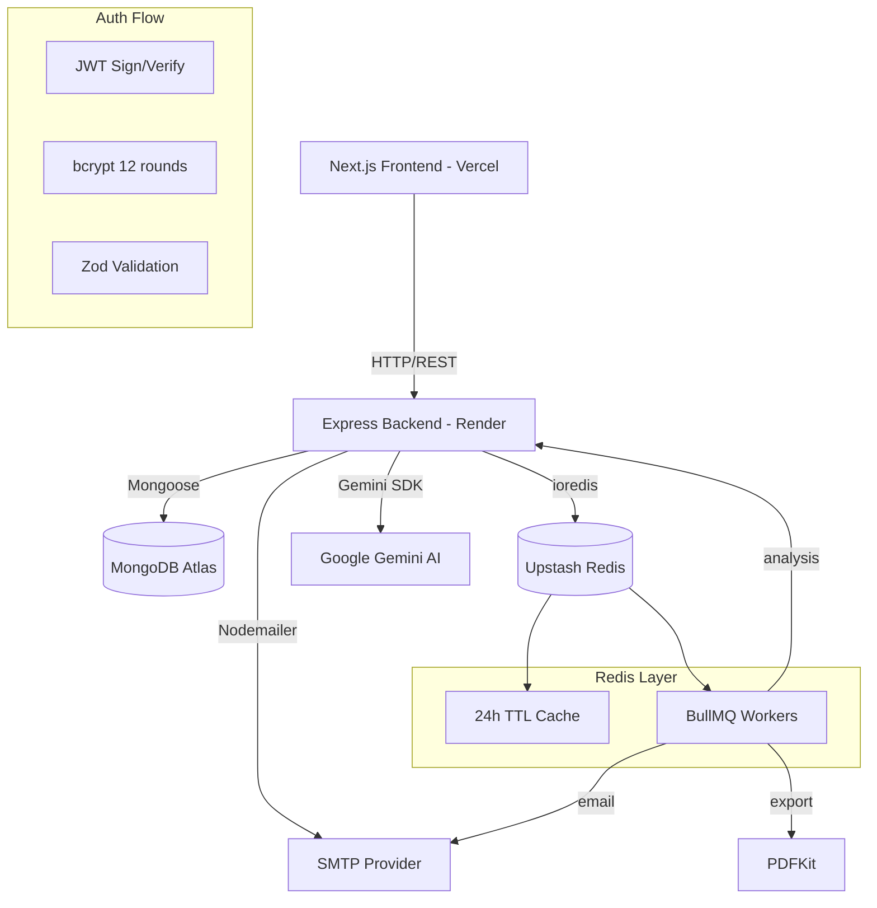

# AI Startup Idea Validator

<p align="center">
  
  
  
  
  
  
  
  
  
  <br/>
  
  
  
</p>

An enterprise-grade, AI-powered SaaS platform for validating, analyzing, benchmarking, and pitching startup ideas. Built with Next.js 16, Express, MongoDB Atlas, and Google Gemini AI.

---

## Problem Statement

Entrepreneurs face three critical challenges when evaluating startup ideas:
1. **No objective validation** — Gut feeling is unreliable; early-stage founders need data-driven scoring.
2. **Time-intensive research** — Market analysis, competitor research, and financial modeling take weeks.
3. **No structured guidance** — Founders lack actionable roadmaps, investor matching, and pitch preparation.

## Solution

Validator Pro provides instant, AI-powered startup analysis that delivers:
- Objective idea scoring (0-100) with success probability
- Comprehensive SWOT, competitor, and market analysis in seconds
- AI-generated action plans, investor pitches, and presentations
- Collaborative team features and public sharing

## Features

### Core AI Features
| Feature | Description |
|---|---|
| **AI Analysis** | Gemini-powered validation with score, SWOT, competition, revenue models, growth strategy, and MVP roadmap |
| **AI Chat** | Context-aware conversational assistant with memory retention across sessions |
| **Pitch Generator** | Full investor pitch deck (executive summary, problem, solution, market, traction, ask) |
| **Presentation Generator** | 12-slide investor deck with PDF and HTML export |
| **Competitor Intelligence** | Deep competitive analysis: funding, pricing, market position, user base estimates |
| **Investor Match** | AI matches startups to ideal investor types, funding stages, and amounts |
| **Market Trends** | Industry breakdown with average scores and AI-generated emerging trends |
| **Mentor Match** | Personalized mentor recommendations with skills gap analysis |
| **Smart Tasks** | AI-generated 4-week action plans with progress tracking |

### Platform Features
| Feature | Description |
|---|---|
| **Authentication** | JWT-based signup/login with bcrypt hashing, refresh tokens, and 401 auto-redirect |
| **Dashboard** | Recharts analytics: score distribution, industry breakdown, analysis timeline |
| **Team Collaboration** | Create teams, invite by email, role management, shared workspaces |
| **Idea Versioning** | Save, compare, and restore previous idea versions with visual diffs |
| **Badge System** | 8 achievement badges auto-awarded on milestones |
| **Activity Tracking** | Full activity log per user with admin analytics |
| **Memory System** | AI remembers past ideas, interactions, and user preferences |
| **Favorites** | Bookmark top analyses with optimistic UI |
| **File Upload** | Analyze from PDF/DOCX with automatic text extraction |

### Enterprise Features
| Feature | Description |
|---|---|
| **Redis Caching** | 24h TTL for analysis responses, 1h for ideas and dashboard |
| **BullMQ Queue** | Background processing for analysis, email, and PDF generation |
| **Performance Monitoring** | P95/P99 latency, endpoint tracking, slow query detection |
| **Swagger API Docs** | Interactive OpenAPI documentation at `/api/docs` |
| **Email Integration** | Nodemailer with templates: analysis complete, team invite, weekly report, reminders |
| **Calendar Sync** | Export tasks to iCal and Google Calendar |
| **Public Sharing** | Generate read-only share links with QR codes |
| **Rate Limiting** | Tiered limits: 200/15min API, 10/15min auth, 20/h analysis |
| **Security** | Helmet, XSS sanitization, CORS, Winston security logging |
| **CI/CD** | GitHub Actions: lint, test, build, auto-deploy to Vercel + Render |

## Tech Stack

| Layer | Technology |
|---|---|
| **Frontend** | Next.js 16, React 19, TypeScript, Tailwind CSS v4, Recharts, Zod |
| **Backend** | Node.js 20, Express 4, TypeScript, Mongoose, JWT, Zod |
| **AI** | Google Gemini 2.0 Flash, Prompt Engineering, Fallback Logic |
| **Database** | MongoDB Atlas (15 collections, indexes, aggregations) |
| **Cache/Queue** | Redis (Upstash) — BullMQ for background jobs |
| **Testing** | Jest 30, Supertest, React Testing Library, MongoMemoryServer |
| **DevOps** | GitHub Actions CI/CD, Vercel (frontend), Render (backend) |
| **Monitoring** | Winston logging (file rotation), Performance middleware |

## Architecture



## Folder Structure

```
.
├── frontend/                    # Next.js 16 App Router
│   ├── src/
│   │   ├── app/                 # Pages (login, signup, dashboard, ideas, chat, features, share, portfolio)
│   │   ├── components/          # Sidebar, MobileNav, ErrorBoundary, LoadingSkeleton
│   │   ├── services/            # API service modules (auth, analysis, chat, teams, etc.)
│   │   └── context/             # AuthContext with localStorage persistence
│   └── jest.config.ts           # Jest + React Testing Library setup
│
├── backend/                     # Express REST API
│   ├── src/
│   │   ├── controllers/         # Route handlers (auth, ideas, analysis, chat, admin, etc.)
│   │   ├── services/            # Business logic (AI, cache, queue, email, calendar, etc.)
│   │   ├── models/              # Mongoose schemas (15 models)
│   │   ├── routes/              # Express routers (20+ route modules)
│   │   ├── middleware/          # Auth, security, rate limiting, performance
│   │   ├── workers/             # BullMQ workers (analysis, email, export)
│   │   ├── config/              # Env, logger, swagger
│   │   ├── utils/               # API response helpers, error classes
│   │   └── __tests__/           # Jest + Supertest integration tests
│   └── docs/                    # Architecture documentation
│
├── mobile/                      # React Native (Expo)
│   └── src/
│       ├── screens/             # Login, Signup, Dashboard, Ideas, Chat, Profile
│       ├── navigation/          # Tab + Stack navigators
│       ├── services/            # Axios API client
│       └── context/             # AuthContext with AsyncStorage
│
├── .github/workflows/           # CI/CD pipeline
├── docs/                        # Architecture, database, API documentation
├── README.md
├── LICENSE
└── DEPLOYMENT.md
```

## Quick Start

### Prerequisites
- Node.js 20+
- MongoDB Atlas connection string
- Google Gemini API key
- (Optional) Redis URL for caching/queues

### Installation

```bash
# Backend
cd backend
cp .env.example .env    # Configure environment variables
npm install
npm run dev             # http://localhost:5000

# Frontend
cd frontend
npm install
npm run dev             # http://localhost:3000
```

### Environment Variables (`backend/.env`)

| Variable | Required | Description |
|---|---|---|
| `MONGO_URI` | Yes | MongoDB Atlas connection string |
| `JWT_SECRET` | Yes | JWT signing secret (min 32 chars) |
| `GEMINI_API_KEY` | Yes | Google Gemini API key |
| `CLIENT_URL` | Yes | Frontend URL for CORS |
| `REDIS_URL` | No | Upstash Redis for cache/queues |
| `SMTP_HOST` | No | Email server host |
| `SMTP_USER` | No | SMTP username |
| `SMTP_PASS` | No | SMTP password |
| `ADMIN_EMAILS` | No | Comma-separated admin emails |

## API Endpoints

### Authentication
| Method | Endpoint | Description |
|---|---|---|
| POST | `/api/auth/signup` | Create account |
| POST | `/api/auth/login` | Sign in |
| POST | `/api/auth/logout` | Sign out |

### Ideas & Analysis
| Method | Endpoint | Description |
|---|---|---|
| GET/POST | `/api/ideas` | List / Create ideas |
| GET/PUT/DELETE | `/api/ideas/:id` | CRUD single idea |
| POST | `/api/analysis/generate` | Run AI analysis |
| GET | `/api/analysis/:ideaId` | Get analysis result |
| POST | `/api/upload` | Upload PDF/DOCX |

### AI Features
| Method | Endpoint | Description |
|---|---|---|
| POST | `/api/chat` | AI chat message |
| GET | `/api/competitors/:id/analyze` | Competitor intelligence |
| GET | `/api/pitch/:ideaId` | Generate investor pitch |
| POST | `/api/presentation/:ideaId` | Generate slide deck |
| GET | `/api/benchmarking/:ideaId` | Score benchmarking |
| POST | `/api/mentor/:ideaId` | Mentor recommendations |
| GET | `/api/investor/:ideaId` | Investor match |
| GET | `/api/trends` | Market trends |

### Teams & Collaboration
| Method | Endpoint | Description |
|---|---|---|
| GET/POST | `/api/teams` | List / Create teams |
| POST | `/api/teams/:id/invite` | Invite member |
| POST | `/api/teams/invite/:id/accept` | Accept invitation |

### Enterprise
| Method | Endpoint | Description |
|---|---|---|
| GET | `/api/admin/performance` | Performance metrics (admin) |
| GET | `/api/admin/dashboard` | Admin analytics |
| GET | `/api/docs` | Swagger API documentation |

Full API docs available at `/api/docs` with request/response examples.

## Database Schema (15 Collections)

```
User ──┬── StartupIdea ── AnalysisResult ── CompetitorInsight
       │         └── IdeaVersion
       ├── ChatHistory
       ├── Task
       ├── Team ── TeamMember ── TeamInvite
       ├── Favorite
       ├── UserMemory
       ├── ActivityLog
       └── UserBadge
```

## Screenshots

*Dashboard Analytics* — Recharts bar/pie/line charts with score distribution, industry breakdown, and analysis timeline.

*Idea Analysis* — AI-generated SWOT, competitor comparison, revenue suggestions, growth strategy, and MVP roadmap.

*AI Chat* — Context-aware conversation with memory retention across sessions, safety-filter handling.

*Presentation Generator* — 12-slide interactive carousel with speaker notes, PDF/HTML export.

*Score Benchmarking* — Industry percentile ranking with peer comparison and trend analysis.

*Competitor Intelligence* — Deep analysis with funding, pricing strategies, and market positioning.

## Future Improvements

- [ ] **WebSocket real-time chat** — Replace polling with Socket.IO for instant AI responses
- [ ] **Multi-language analysis** — Support non-English startup descriptions
- [ ] **GPT-4o fallback** — Additional AI provider for redundancy
- [ ] **Stripe subscription** — Freemium tier with paid analysis credits
- [ ] **Weekly email reports** — Cron-based email summaries
- [ ] **Mobile push notifications** — Expo push for task reminders and analysis completion
- [ ] **Social login** — Google/GitHub OAuth integration
- [ ] **Custom branding** — White-label reports and sharing

## Deployment

See [DEPLOYMENT.md](./DEPLOYMENT.md) for complete deployment instructions.

| Service | Platform | URL |
|---|---|---|
| Frontend | Vercel | `https://ai-startup-validator.vercel.app` |
| Backend | Render | `https://api.validatorpro.app` |
| Database | MongoDB Atlas | M10+ cluster |
| Cache/Queue | Upstash Redis | Serverless Redis |

## License

MIT License — see [LICENSE](./LICENSE) for details.

---

<p align="center">
  Built with Next.js 16, Express, TypeScript, MongoDB, Redis, and Google Gemini AI
</p>
