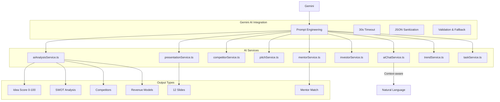
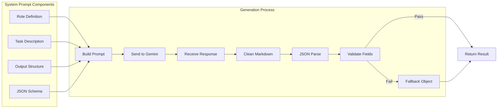
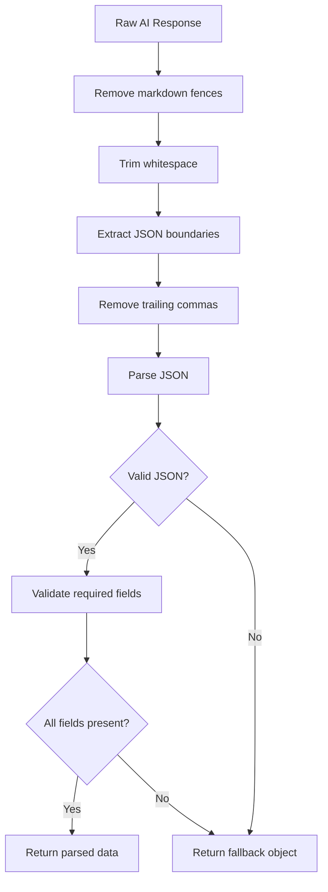
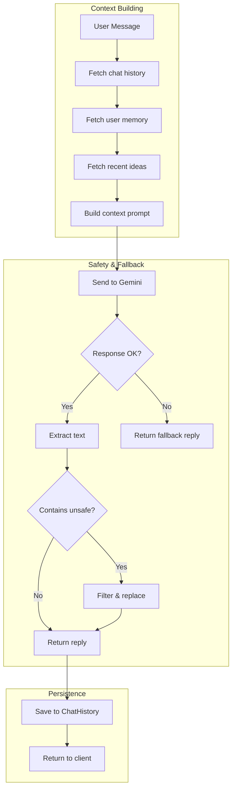
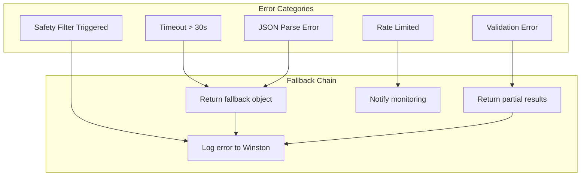
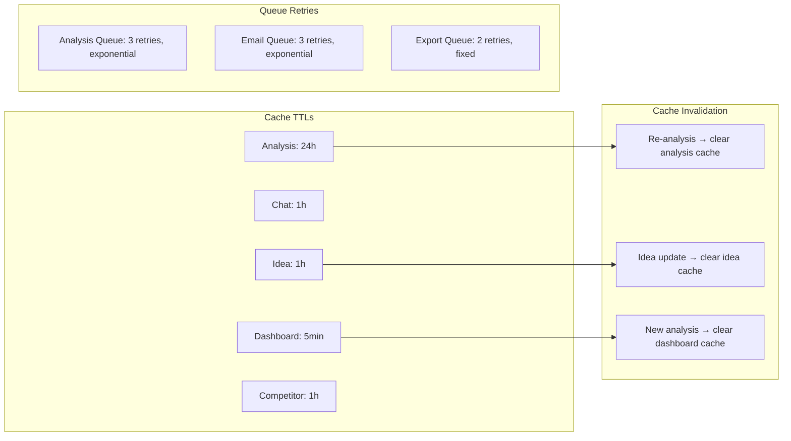

# AI Workflow Documentation

## AI Services Overview



## Prompt Strategy



## Analysis Prompt Example

```text
You are a startup analyst. Analyze this idea:

Startup: "AI-Powered Recipe Generator"
Industry: "Food Tech"
Description: "..."
Target Audience: "Health-conscious consumers..."
Business Model: "Freemium with subscription"

Return ONLY valid JSON (no markdown):
{
  "ideaScore": 0-100,
  "marketDemand": "string",
  "competition": "string",
  "competitors": [{ "name": "", "strengths": "", "weaknesses": "" }],
  "swot": { "strengths": [], "weaknesses": [], ... },
  "revenueSuggestions": [],
  "growthStrategy": "",
  "mvpRoadmap": [],
  "successProbability": 0-100
}
```

## JSON Sanitization Pipeline



## Context-Aware Chat



## Error Handling Strategy



## Cache & Queue Strategy


