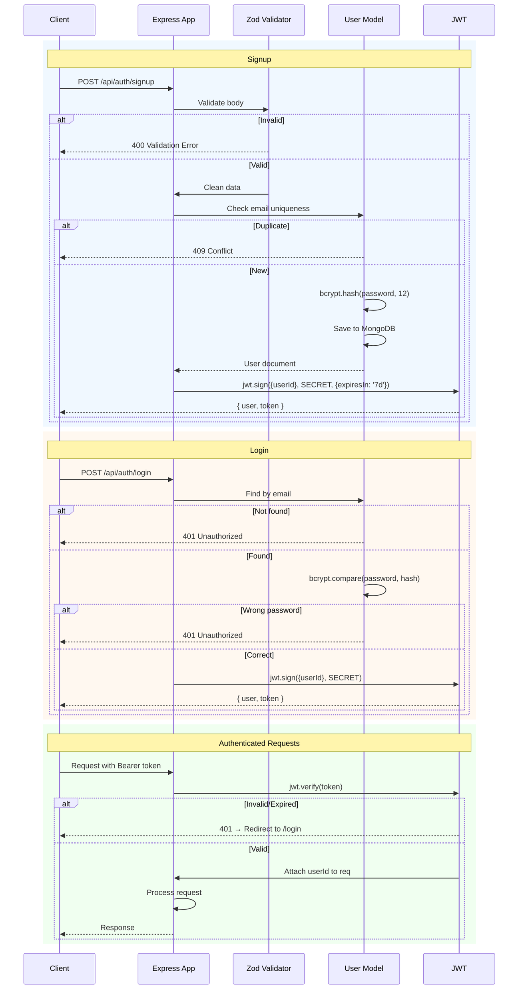
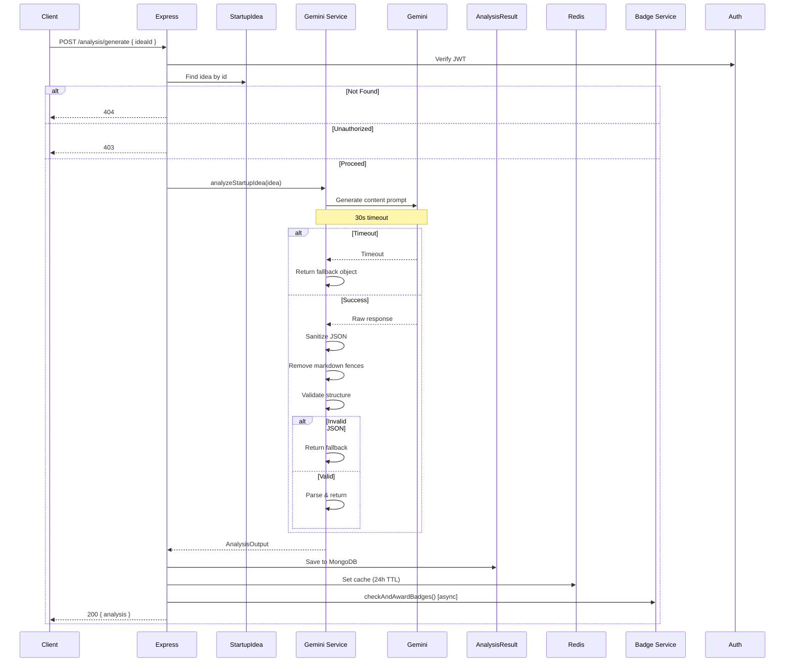
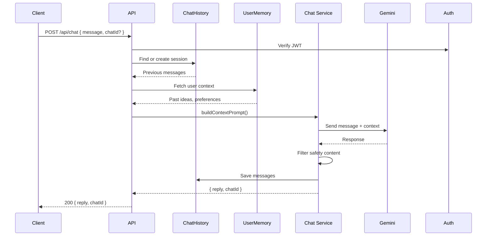
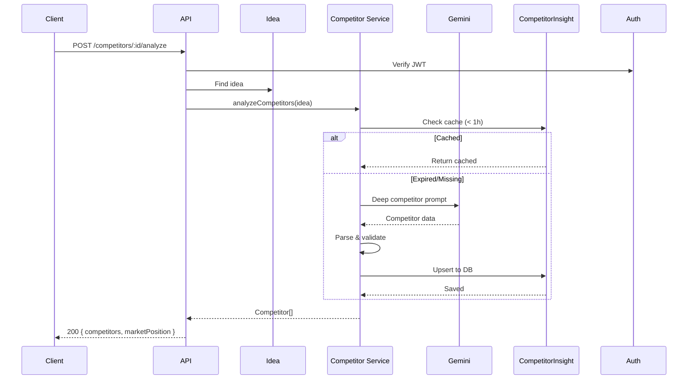
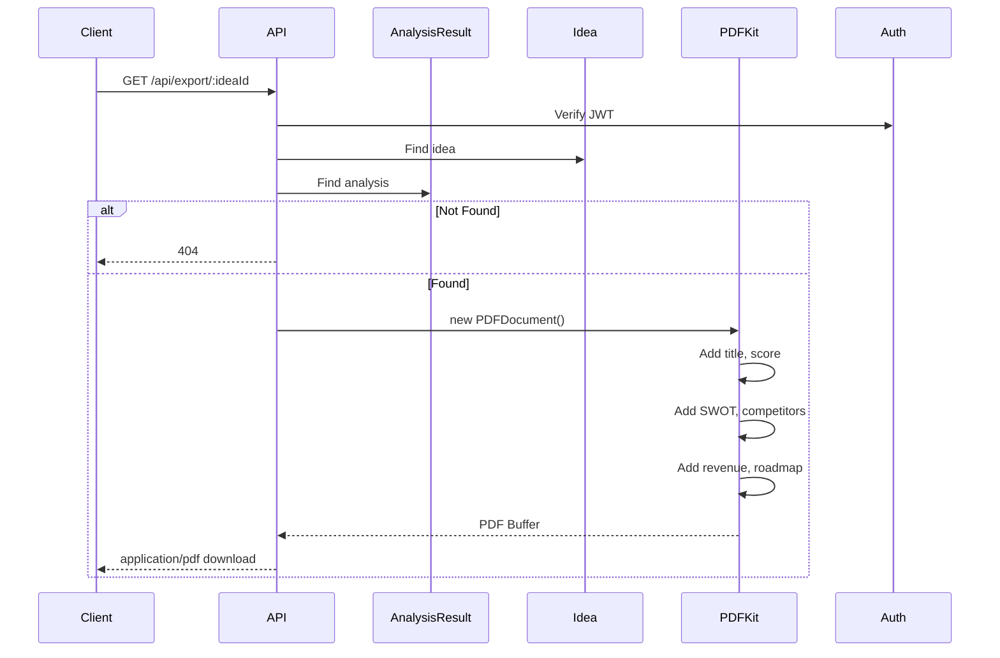

# API Flow Documentation

## Authentication Flow

```mermaid
sequenceDiagram
    participant Client
    participant App as Express App
    participant Val as Zod Validator
    participant User as User Model
    participant JWT

    rect rgb(240, 248, 255)
        Note over Client,JWT: Signup
        Client->>App: POST /api/auth/signup
        App->>Val: Validate body
        alt Invalid
            Val-->>Client: 400 Validation Error
        else Valid
            Val->>App: Clean data
            App->>User: Check email uniqueness
            alt Duplicate
                User-->>Client: 409 Conflict
            else New
                User->>User: bcrypt.hash(password, 12)
                User->>User: Save to MongoDB
                User-->>App: User document
                App->>JWT: jwt.sign({userId}, SECRET, {expiresIn: '7d'})
                JWT-->>Client: { user, token }
            end
        end
    end

    rect rgb(255, 248, 240)
        Note over Client,JWT: Login
        Client->>App: POST /api/auth/login
        App->>User: Find by email
        alt Not found
            User-->>Client: 401 Unauthorized
        else Found
            User->>User: bcrypt.compare(password, hash)
            alt Wrong password
                User-->>Client: 401 Unauthorized
            else Correct
                App->>JWT: jwt.sign({userId}, SECRET)
                JWT-->>Client: { user, token }
            end
        end
    end

    rect rgb(240, 255, 240)
        Note over Client,JWT: Authenticated Requests
        Client->>App: Request with Bearer token
        App->>JWT: jwt.verify(token)
        alt Invalid/Expired
            JWT-->>Client: 401 → Redirect to /login
        else Valid
            JWT->>App: Attach userId to req
            App->>App: Process request
            App-->>Client: Response
        end
    end
```

## AI Analysis Flow

```mermaid
sequenceDiagram
    participant Client
    participant API as Express
    participant Idea as StartupIdea
    participant AI as Gemini Service
    participant Gemini
    participant Result as AnalysisResult
    participant Cache as Redis
    participant Badge as Badge Service

    Client->>API: POST /analysis/generate { ideaId }
    API->>Auth: Verify JWT
    API->>Idea: Find idea by id
    alt Not Found
        API-->>Client: 404
    else Unauthorized
        API-->>Client: 403
    else Proceed
        API->>AI: analyzeStartupIdea(idea)
        AI->>Gemini: Generate content prompt
        Note over AI,Gemini: 30s timeout

        alt Timeout
            Gemini-->>AI: Timeout
            AI->>AI: Return fallback object
        else Success
            Gemini-->>AI: Raw response
            AI->>AI: Sanitize JSON
            AI->>AI: Remove markdown fences
            AI->>AI: Validate structure
            alt Invalid JSON
                AI->>AI: Return fallback
            else Valid
                AI->>AI: Parse & return
            end
        end

        AI-->>API: AnalysisOutput
        API->>Result: Save to MongoDB
        API->>Cache: Set cache (24h TTL)
        API->>Badge: checkAndAwardBadges() [async]
        API-->>Client: 200 { analysis }
    end
```

## Chat Flow

```mermaid
sequenceDiagram
    participant Client
    participant API
    participant Chat as ChatHistory
    participant Memory as UserMemory
    participant AI as Chat Service
    participant Gemini

    Client->>API: POST /api/chat { message, chatId? }
    API->>Auth: Verify JWT
    API->>Chat: Find or create session
    Chat-->>API: Previous messages
    API->>Memory: Fetch user context
    Memory-->>API: Past ideas, preferences
    API->>AI: buildContextPrompt()
    AI->>Gemini: Send message + context
    Gemini-->>AI: Response
    AI->>AI: Filter safety content
    AI->>Chat: Save messages
    AI-->>API: { reply, chatId }
    API-->>Client: 200 { reply, chatId }
```

## Competitor Intelligence Flow

```mermaid
sequenceDiagram
    participant Client
    participant API
    participant Idea
    participant Comp as Competitor Service
    participant Gemini
    participant Insight as CompetitorInsight

    Client->>API: POST /competitors/:id/analyze
    API->>Auth: Verify JWT
    API->>Idea: Find idea
    API->>Comp: analyzeCompetitors(idea)
    Comp->>Insight: Check cache (< 1h)
    alt Cached
        Insight-->>Comp: Return cached
    else Expired/Missing
        Comp->>Gemini: Deep competitor prompt
        Gemini-->>Comp: Competitor data
        Comp->>Comp: Parse & validate
        Comp->>Insight: Upsert to DB
        Insight-->>Comp: Saved
    end
    Comp-->>API: Competitor[]
    API-->>Client: 200 { competitors, marketPosition }
```

## Export Flow

```mermaid
sequenceDiagram
    participant Client
    participant API
    participant Result as AnalysisResult
    participant Idea
    participant PDF as PDFKit

    Client->>API: GET /api/export/:ideaId
    API->>Auth: Verify JWT
    API->>Idea: Find idea
    API->>Result: Find analysis
    alt Not Found
        API-->>Client: 404
    else Found
        API->>PDF: new PDFDocument()
        PDF->>PDF: Add title, score
        PDF->>PDF: Add SWOT, competitors
        PDF->>PDF: Add revenue, roadmap
        PDF-->>API: PDF Buffer
        API-->>Client: application/pdf download
    end
```
