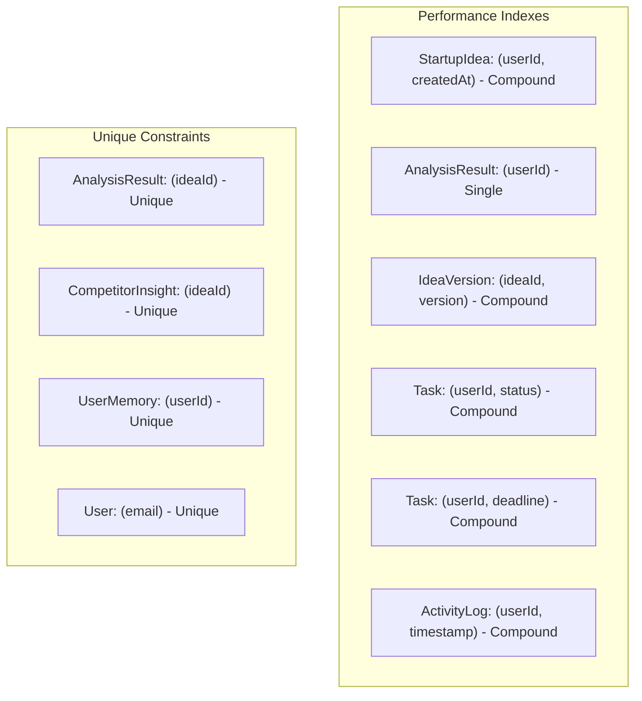

# Database Schema

## Entity Relationship Diagram

```mermaid
erDiagram
    User ||--o{ StartupIdea : "creates"
    User ||--o{ AnalysisResult : "owns"
    User ||--o{ CompetitorInsight : "owns"
    User ||--o{ IdeaVersion : "tracks"
    User ||--o{ Task : "assigned"
    User ||--o{ ChatHistory : "has"
    User ||--o{ Favorite : "saves"
    User ||--o{ UserMemory : "has"
    User ||--o{ ActivityLog : "generates"
    User ||--o{ UserBadge : "earns"
    User ||--o{ Team : "owns"
    User ||--o{ TeamMember : "member of"

    StartupIdea ||--|| AnalysisResult : "analyzed by"
    StartupIdea ||--o{ CompetitorInsight : "has"
    StartupIdea ||--o{ IdeaVersion : "versioned"
    StartupIdea ||--o{ Favorite : "favorited"

    Team ||--o{ TeamMember : "includes"
    Team ||--o{ TeamInvite : "sends"

    User {
        ObjectId _id PK
        string fullName
        string email UK
        string password
        string startupExperience
        string industryInterest
        string profileImage
        date createdAt
        date updatedAt
    }

    StartupIdea {
        ObjectId _id PK
        ObjectId userId FK
        string title
        string description
        string industry
        string targetAudience
        string budget
        string businessModel
        string problemStatement
        string expectedSolution
        date createdAt
        date updatedAt
    }

    AnalysisResult {
        ObjectId _id PK
        ObjectId ideaId FK UK
        ObjectId userId FK
        int ideaScore
        int successProbability
        string marketDemand
        string competition
        array competitors
        object swot
        array revenueSuggestions
        string growthStrategy
        array mvpRoadmap
        date createdAt
    }

    CompetitorInsight {
        ObjectId _id PK
        ObjectId ideaId FK UK
        ObjectId userId FK
        array competitors
        string marketPosition
        date generatedAt
    }

    IdeaVersion {
        ObjectId _id PK
        ObjectId ideaId FK
        ObjectId userId FK
        int version
        object snapshot
        array changes
        date createdAt
    }

    Task {
        ObjectId _id PK
        ObjectId userId FK
        string title
        string description
        string status
        string priority
        date deadline
        date completedAt
        date createdAt
    }

    ChatHistory {
        ObjectId _id PK
        ObjectId userId FK
        array messages
        date createdAt
        date updatedAt
    }

    Team {
        ObjectId _id PK
        string name
        ObjectId owner FK
        string inviteCode
        date createdAt
    }

    TeamMember {
        ObjectId _id PK
        ObjectId teamId FK
        ObjectId userId FK
        string role
    }

    TeamInvite {
        ObjectId _id PK
        ObjectId teamId FK
        string email
        string status
        date expiresAt
    }

    UserMemory {
        ObjectId _id PK
        ObjectId userId FK UK
        array previousIdeas
        array interactions
        object preferences
    }

    ActivityLog {
        ObjectId _id PK
        ObjectId userId FK
        string action
        string resource
        object details
        string ip
        date timestamp
    }

    UserBadge {
        ObjectId _id PK
        ObjectId userId FK
        string badgeId
        string name
        string description
        string icon
        date earnedAt
    }

    Favorite {
        ObjectId _id PK
        ObjectId userId FK
        ObjectId ideaId FK
        date createdAt
    }
```

## Index Strategy



## Collections Summary

| Collection | Documents | Key Index | Purpose |
|---|---|---|---|
| User | Auth users | email (unique) | Authentication & profiles |
| StartupIdea | N+ | userId + createdAt | Core business entity |
| AnalysisResult | N | ideaId (unique) | AI analysis output |
| CompetitorInsight | N | ideaId (unique) | AI competitor analysis |
| IdeaVersion | 20N+ | ideaId + version | History tracking |
| Task | 8N+ | userId + status | Action plans |
| ChatHistory | N | userId | AI conversations |
| Team | M | — | Collaboration groups |
| ActivityLog | 100N+ | userId + timestamp | Audit trail |
| UserBadge | 8N | userId | Gamification |
