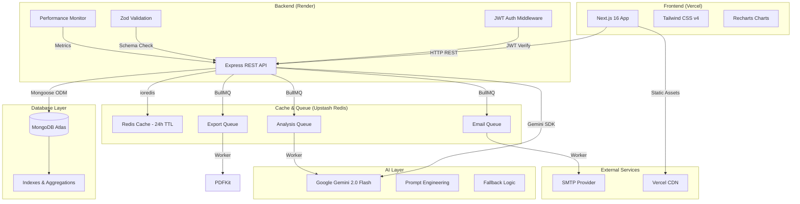
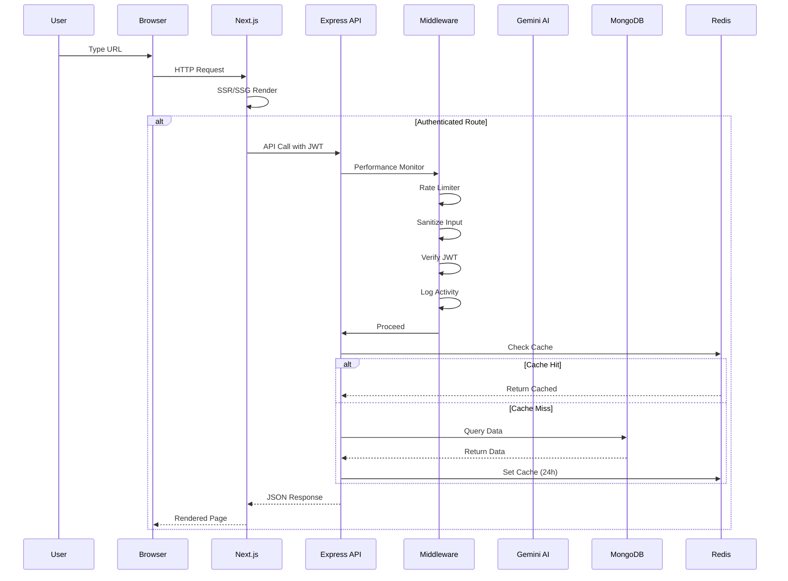
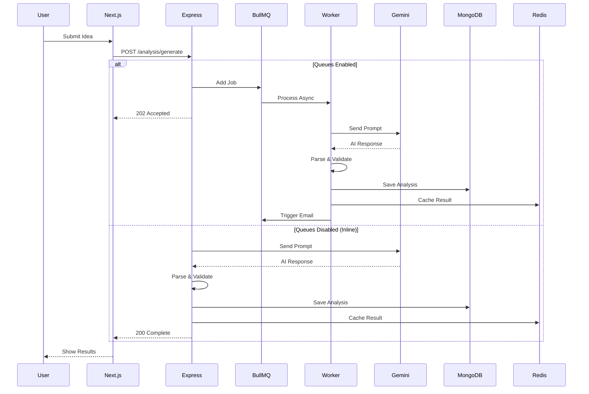
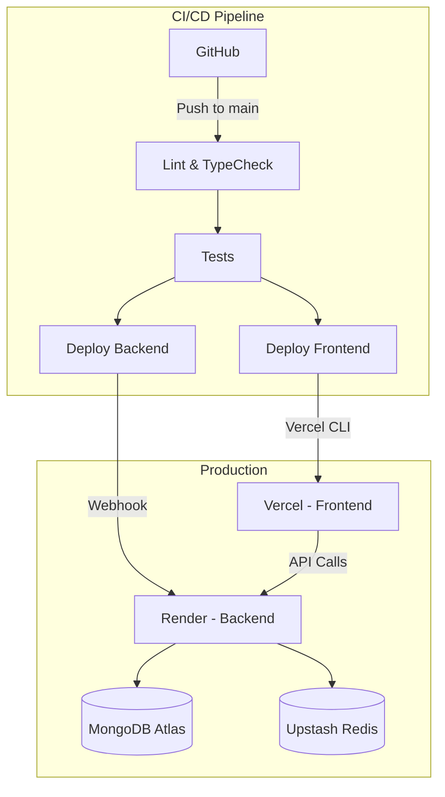

# System Architecture

## High-Level Architecture



## Request Lifecycle



## AI Request Lifecycle



## Security Architecture

```mermaid
graph LR
    Client[Client Browser]
    CDN[Vercel CDN]
    WAF[Helmet Headers]
    CORS[CORS Policy]
    RL[Rate Limiter]
    San[Input Sanitizer]
    Auth[JWT Auth]
    API[API Handler]

    Client -->|HTTPS| CDN
    CDN -->|Proxy| WAF
    WAF --> CORS
    CORS --> RL
    RL --> San
    San --> Auth
    Auth --> API

    RL -->|200 req/15min| API
    RL -->|10 req/15min| AuthEP[/api/auth]
    RL -->|20 req/h| AnalysisEP[/api/analysis]
```

## Deployment Architecture


